# Báo cáo cá nhân — K4-L3B Day 13 Monitoring & LLMOps

## 1. Thông tin học viên

- **Họ và tên:** Lê Văn Việt
- **MSSV:** 2A202602504
- **Lớp:** K4-L3B
- **Repository URL:** https://github.com/viett06/K4-L3-DAY13-LeVanViet-2A202602504-Monitoring-LLMOps
- **Commit SHA cuối:** `0dada7d64a2dcd7f594d4ba1f6b4b4c0b9043371` (`0dada7d`), trên `main`, ngay sau starter `61a34f8`.
- **Challenge ID:** không có. `config/challenge.json` chưa được Lab Coach release, nên điều tra bằng practice scenario `rag_slow`, không tự tạo file challenge.
- **Tên project Langfuse cá nhân:** key hợp lệ trên `https://us.cloud.langfuse.com`. Project id `cmunjid0304ucad0cv0yg1wsm`, tổ chức `Việt's Organization`. Tên trên UI hiện là `My Project`. API key của project bị từ chối khi đổi tên (`AccessDenied`). Cần đổi tay trên UI thành `day13-k4-l3b-2A202602504`. Trang trace: `https://us.cloud.langfuse.com/project/cmunjid0304ucad0cv0yg1wsm/traces`

## 2. Evidence index

| Evidence | Đường dẫn |
|---|---|
| Pytest cuối | `evidence/01-pytest.png` |
| Log validator | `evidence/02-log-validator.png` |
| Dashboard validator | `evidence/03-dashboard-validator.png` |
| Structured log | `evidence/04-structured-log.png` |
| PII redaction | `evidence/05-pii-redaction.png` |
| Trace list | `evidence/06-trace-list.png` |
| Trace waterfall | `evidence/07-trace-waterfall.png` |
| Trace metadata | `evidence/08-trace-metadata.png` |
| Prompt versions | `evidence/09-prompt-versions.png` |
| Prompt rollback | `evidence/10-prompt-rollback.png` |
| Dashboard runtime | `evidence/11-dashboard-overview.png` |
| Incident metric | `evidence/12-incident-metric.png` |
| Incident log | `evidence/13-incident-log.png` |
| Span timing cùng correlation ID | `evidence/14-incident-trace.png` |

Số đo thô nằm ở `evidence/metrics-summary.json`. `data/logs.jsonl` không được commit.

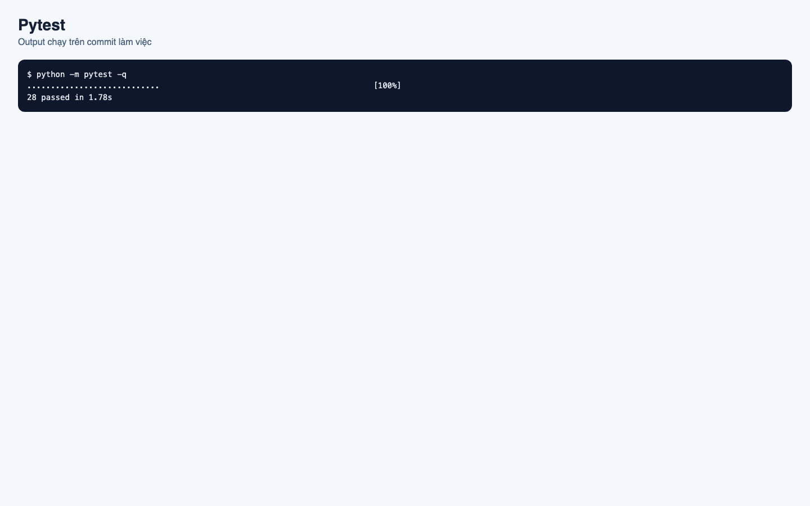

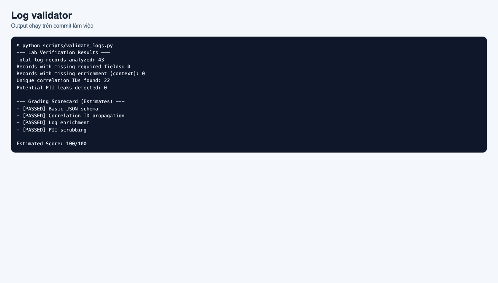

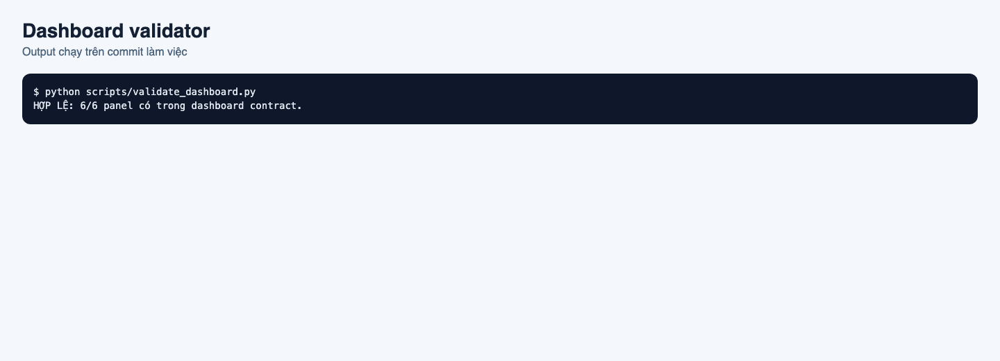

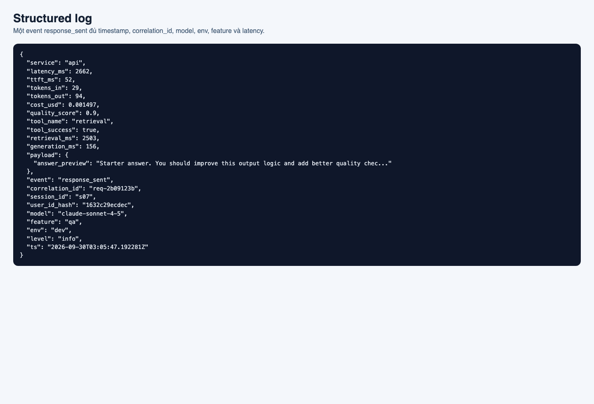

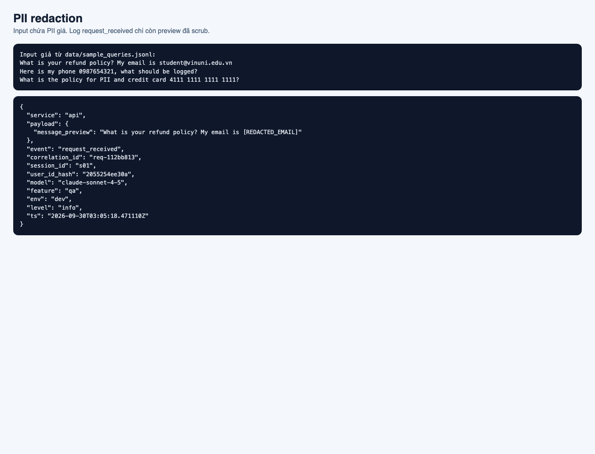

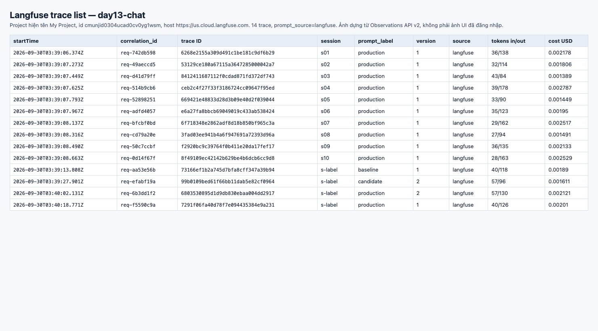

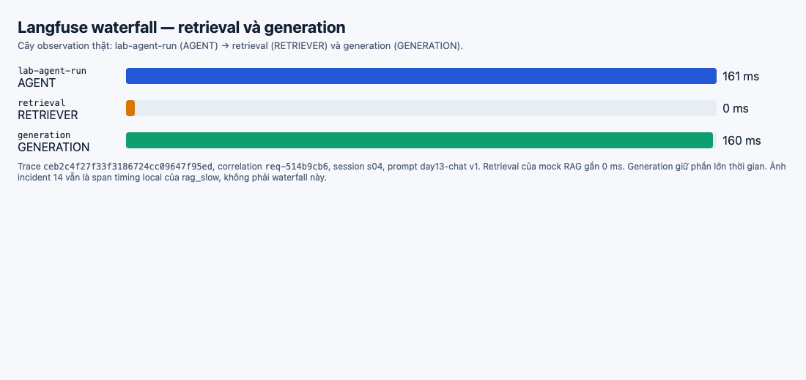

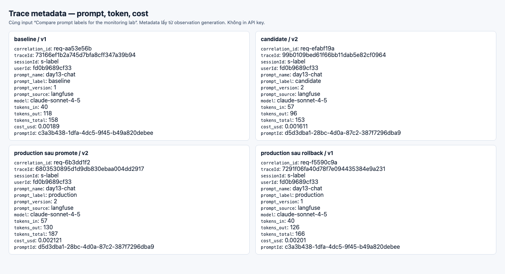

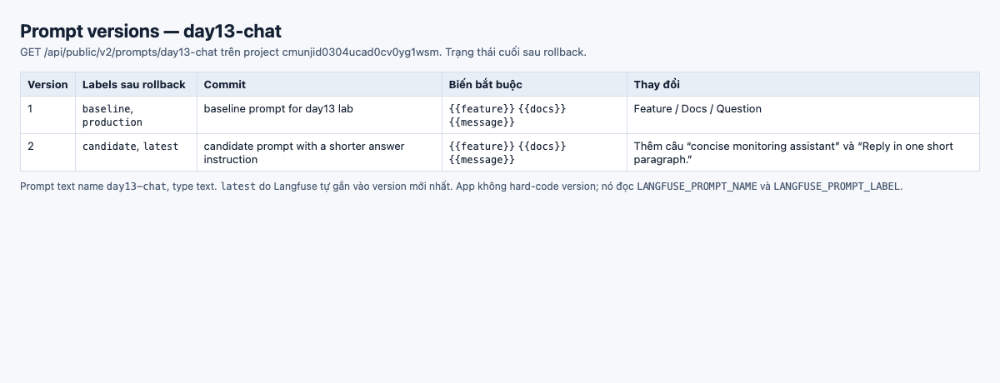

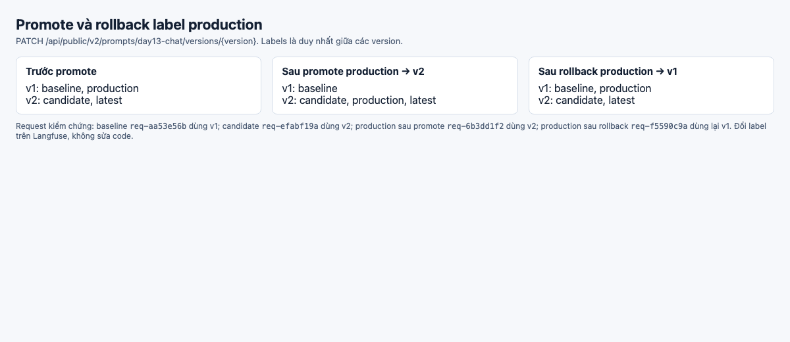

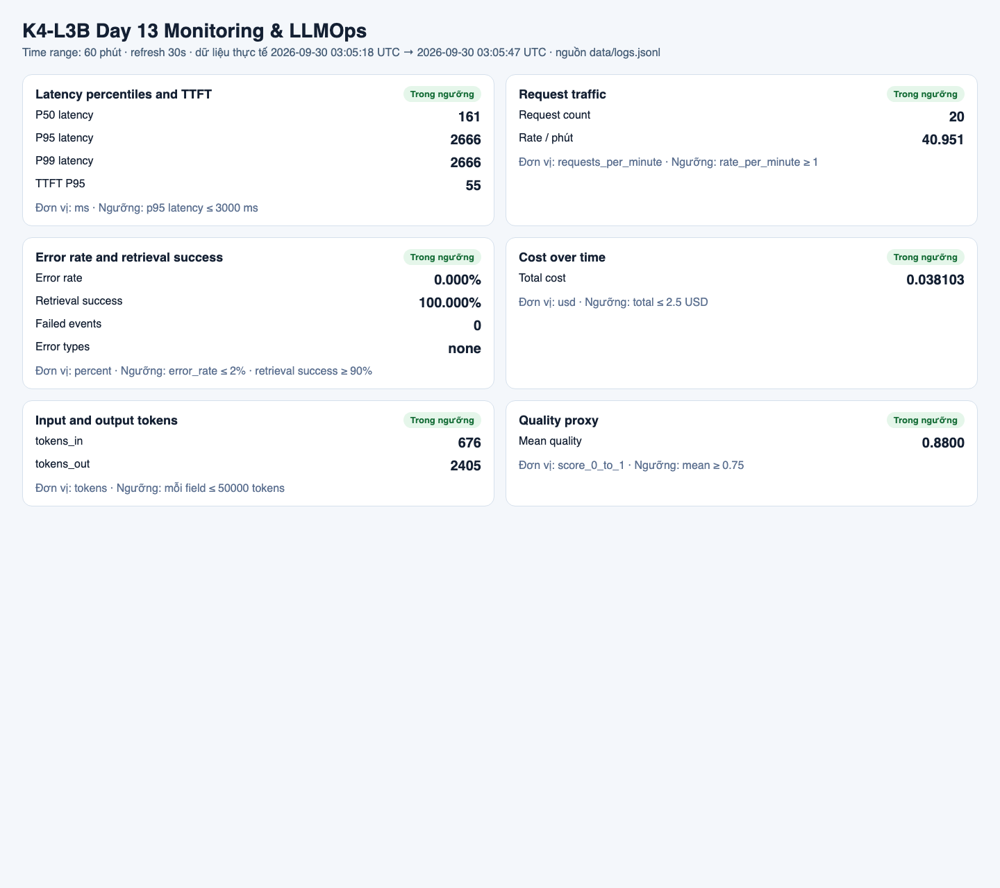

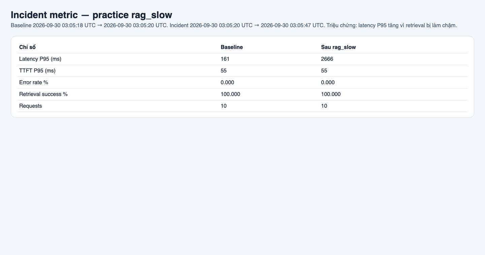

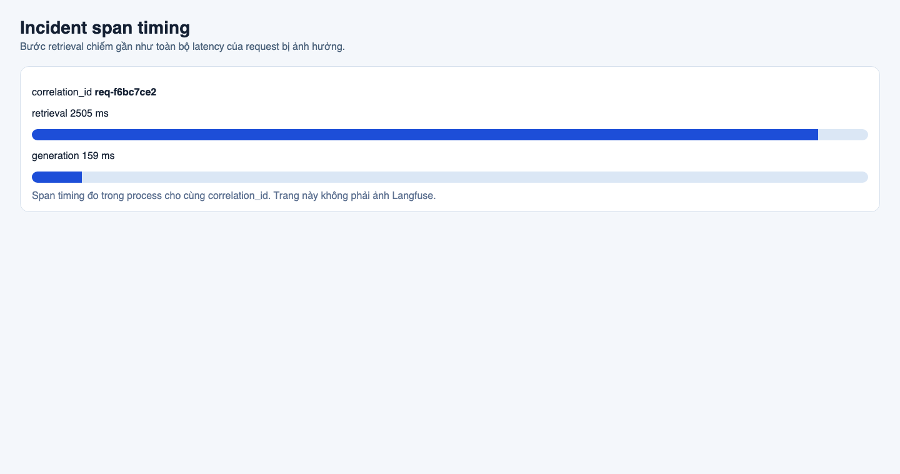

## 3. Kết quả kỹ thuật

| Nội dung | Baseline | Kết quả cuối | Nhận xét |
|---|---|---|---|
| `validate_logs.py` | Không đo trên starter trước khi sửa | 100/100, 43 dòng, 22 correlation ID, 0 PII leak | Starter để `correlation_id = "MISSING"` và chưa gắn scrubber |
| `validate_dashboard.py` | Contract starter đã đủ 6 panel | `HỢP LỆ: 6/6 panel` | Panel errors được thêm event `response_sent` để có `tool_success=true` |
| `pytest` | — | 28 passed | Thêm test correlation, PII, scrubber và child observation |
| Số traces hợp lệ | 0 | 14 trace trên Langfuse, tất cả `prompt_source=langfuse` | 10 request `production` v1, rồi baseline v1, candidate v2, production sau promote v2, production sau rollback v1 |
| Số PII leak | — | 0 | Email, điện thoại, CCCD, thẻ, hộ chiếu, địa chỉ đều thành token `REDACTED_*` |
| Latency P95 / TTFT P95 | 161 ms / 55 ms trên 10 request | Cửa sổ gộp: P50 161 ms, P95 2666 ms, TTFT P95 55 ms | P50 vẫn thấp, P95 lộ retrieval chậm |
| Retrieval success rate | 100% | 100% cả sau `rag_slow` | Scenario làm chậm retrieval, không làm fail tool |

Workload: 10 request baseline tuần tự, sau đó bật `rag_slow` và gửi 10 request với concurrency 5. Cửa sổ log: 2026-09-30 03:05:18 UTC đến 03:05:47 UTC.

## 4. Logging và PII

- **Cách tạo/nhận và truyền correlation ID:** `CorrelationIdMiddleware` xóa context cũ mỗi request, nhận `x-request-id` nếu đúng dạng `req-` + 8 ký tự hex, nếu không thì sinh `req-<8 hex>`. ID được bind vào structlog, gán `request.state.correlation_id`, và trả lại qua header `x-request-id` cùng `x-response-time-ms`.
- **Các metadata được ghi vào structured log:** trước `request_received`, API bind `user_id_hash` (SHA-256 cắt 12 ký tự), `session_id`, `feature`, `model`, `env`. Log `response_sent` thêm `latency_ms`, `ttft_ms`, token, cost, `quality_score`, `tool_name`, `tool_success`, `retrieval_ms`, `generation_ms`.
- **Cách bảo đảm PII được scrub trước khi ghi:** `summarize_text` scrub preview ngay tại chỗ gọi log. `scrub_event` chạy trong chuỗi processor trước `JsonlFileProcessor` và `JSONRenderer`, kể cả payload lồng nhau. Pattern gồm email, điện thoại Việt Nam, CCCD 12 số, thẻ 16 số, hộ chiếu dạng một chữ in hoa + 7 số, và cụm địa chỉ Việt Nam có dấu hoặc không dấu.
- **Cách kiểm chứng kết quả:** `validate_logs.py` = 100/100. Ảnh `evidence/05-pii-redaction.png` đối chiếu input giả trong `data/sample_queries.jsonl` với `message_preview` đã thành `[REDACTED_EMAIL]`.

## 5. Tracing và prompt versioning

- **Cách xác nhận traces do chính tôi tạo trong project cá nhân:** `/health` trả `tracing_enabled: true` khi process có key. Observations API v2 của project `cmunjid0304ucad0cv0yg1wsm` trả 14 trace tạo lúc 2026-09-30 03:39–03:40 UTC. Mỗi trace có `correlation_id` khớp log local, `prompt_name=day13-chat`, `prompt_source=langfuse`. Preview trên span đã scrub; quét payload không thấy email, số điện thoại hay số thẻ. Ảnh `06`–`10` dựng từ JSON API này vì Chrome headless không đăng nhập được UI Langfuse.
- **Cấu trúc root/retrieval/generation observations:** trace `ceb2c4f27f33f3186724cc09647f95ed`, correlation `req-514b9cb6`. Root `lab-agent-run` loại AGENT 161 ms. Child `retrieval` loại RETRIEVER 0 ms. Child `generation` loại GENERATION 160 ms, model `claude-sonnet-4-5`, prompt `day13-chat` v1. Ảnh `evidence/07-trace-waterfall.png`.
- **Cách nối trace với log:** metadata span mang `correlation_id`. Ví dụ log `req-514b9cb6` và trace `ceb2c4f27f33f3186724cc09647f95ed` là cùng một request. Incident `rag_slow` trước đó vẫn là `req-f6bc7ce2`; phiên đó chưa bật tracing nên không có trace cloud.
- **Prompt name:** `day13-chat`, type text, giữ `{{feature}}`, `{{docs}}`, `{{message}}`.
- **Version/label baseline:** v1, commit “baseline prompt for day13 lab”. Sau rollback, label là `baseline` và `production`. Prompt id `c3a3b438-1dfa-4dc5-9f45-b49a820debee`.
- **Version/label candidate:** v2, thêm hướng dẫn trả lời ngắn. Label `candidate`. `latest` do Langfuse gắn vào version mới nhất. Prompt id `d5d3dba1-28bc-4d0a-87c2-387f7296dba9`.
- **Trace ID của mỗi version, cùng input “Compare prompt labels for the monitoring lab”:**
  - baseline v1: correlation `req-aa53e56b`, trace `73166ef1b2a745d7bfa8cff347a39b94`, tokens 40/118, cost 0.00189 USD
  - candidate v2: correlation `req-efabf19a`, trace `99b0109bed61f66bb11dab5e82cf0964`, tokens 57/96, cost 0.001611 USD
  - production sau promote, v2: correlation `req-6b3dd1f2`, trace `6803530895d1d9db830ebaa004dd2917`, tokens 57/130, cost 0.002121 USD
  - production sau rollback, v1: correlation `req-f5590c9a`, trace `7291f06fa40d78f7e094435384e9a231`, tokens 40/126, cost 0.00201 USD
- **Cách promote và rollback `production`:** app chỉ đọc `LANGFUSE_PROMPT_NAME` và `LANGFUSE_PROMPT_LABEL`. Promote gán `production` sang v2 (`v1` còn `baseline`; `v2` thành `candidate`, `production`, `latest`). Rollback gán `production` về v1 (`v1` = `baseline` + `production`; `v2` = `candidate` + `latest`). Ảnh `evidence/10-prompt-rollback.png`. Code không hard-code version. Host của key là US, nên `.env` dùng `LANGFUSE_BASE_URL=https://us.cloud.langfuse.com`. API US đôi khi chậm hơn timeout mặc định, nên process chạy lab đặt `LANGFUSE_TIMEOUT=60` và `LANGFUSE_PROMPT_FETCH_TIMEOUT=30`. Khi hai biến này vắng, code vẫn dùng timeout fetch 2 giây.

## 6. Dashboard, SLO và alerts

- **Dashboard và sáu panel:** `scripts/render_dashboard.py` đọc `data/logs.jsonl` theo contract `config/dashboard.yaml`. Ảnh `evidence/11-dashboard-overview.png` có time range 60 phút, refresh 30 giây, đơn vị và ngưỡng. Số trên cửa sổ gộp: latency P50/P95/P99 = 161/2666/2666 ms, TTFT P95 = 55 ms, 20 request, error rate 0%, retrieval success 100%, cost 0.038103 USD, tokens in/out = 676/2405, quality mean 0.88.
- **SLO và lý do chọn:** giữ `fast_successful_requests`, cửa sổ 28 ngày, target 99.5%, request tốt là `response_sent` với `latency_ms <= 3000`. Ngưỡng 3000 ms là contract dashboard. Baseline P95 chỉ 161 ms nên SLO không bị nhiễu đo local. Practice `rag_slow` đẩy latency nội bộ lên 2666 ms, sát nhưng chưa vượt SLO.
- **Cách tính error budget:** 100% - 99.5% = 0.5%. Với 10,000 request trong 28 ngày, ngân sách là 50 request lỗi hoặc chậm hơn 3000 ms. Demo 20 request, tất cả đều dưới 3000 ms và không có `request_failed`, nên SLI phiên này là 100% và chưa đốt ngân sách.
- **Ba alert và runbook tương ứng:**
  1. `HighLatencyP95`, warning, `p95(response_sent.latency_ms) > 1000` trong 5 phút, Slack `#k4-l3b-alerts`. Ngưỡng 1000 ms là cảnh báo sớm: baseline 161 ms, hồi quy `rag_slow` ở 2666 ms, trong khi SLO vẫn là 3000 ms.
  2. `ElevatedErrorRate`, critical, error rate > 2% trong 5 phút.
  3. `RetrievalSuccessDrop`, warning, retrieval success < 90% trong 10 phút.
  Runbook: `docs/alerts.md`. Owner: `student-2A202602504`.

## 7. Điều tra challenge

Đây là practice `rag_slow`, không phải challenge chính thức.

- **Challenge ID:** không có file release.
- **Khoảng thời gian điều tra:** baseline 2026-09-30 03:05:18 UTC → 03:05:20 UTC. Incident 03:05:20 UTC → 03:05:47 UTC, sau `python scripts/inject_incident.py --scenario rag_slow`.
- **Triệu chứng từ metrics:** latency P95 từ 161 ms lên 2666 ms. TTFT P95 giữ 55 ms. Error rate 0%. Retrieval success giữ 100%. Quality mean giữ 0.88. P50 của cả cửa sổ vẫn 161 ms, nên nhìn trung vị sẽ bỏ sót đuôi.
- **Log line và correlation ID liên quan:** `response_sent` lúc `2026-09-30T03:05:41.857891Z`, `correlation_id=req-f6bc7ce2`, `latency_ms=2666`, `retrieval_ms=2505`, `generation_ms=159`, `ttft_ms=53`, `tool_success=true`.
- **Trace ID và span gây ảnh hưởng:** không có trace ID Langfuse. Span timing cùng correlation ID cho thấy retrieval 2505 ms và generation 159 ms. Bước gây chậm là retrieval.
- **Root cause:** `mock_rag.retrieve` ngủ 2.5 giây khi `STATE["rag_slow"]` bật. Generation và TTFT không đổi, tool vẫn success, nên đây không phải lỗi model, prompt, cost hay vector-store timeout.
- **Fix action:** đã tắt scenario bằng `python scripts/inject_incident.py --scenario rag_slow --disable`. Trên hệ thật thì đặt timeout cho retriever và trả fallback đã scrub thay vì chặn worker.
- **Preventive measure:** alert `HighLatencyP95` ở 1000 ms, vì success rate 100% nên `RetrievalSuccessDrop` không bắt được kiểu chậm này. Runbook bắt buộc so `retrieval_ms` với `generation_ms` trên cùng `correlation_id`. Thêm: `chat()` gọi `agent.run()` đồng bộ nên concurrency 5 bị xếp hàng trên một event loop; client đo khoảng 13 s trong khi log nội bộ chỉ 2.7 s. Nên đưa agent sang thread pool để một retrieval chậm không chặn các request khác.

## 8. Giải thích và tự đánh giá

- **Một quyết định kỹ thuật quan trọng và lý do:** tách thời gian retrieval và generation ngay trong log, đồng thời cảnh báo latency ở 1000 ms thay vì chỉ ở vạch SLO 3000 ms. Baseline P95 là 161 ms. Hồi quy 2666 ms làm người dùng chờ gấp khoảng 16 lần nhưng chưa đốt error budget. Nếu alert dính vào 3000 ms thì practice này không cháy. SLO giữ 3000 ms để khỏi lệch contract dashboard.
- **Một lỗi/blocker đã gặp:** key Langfuse bị 401 trên host EU trong `.env.example`. Cùng key trả 200 trên `https://us.cloud.langfuse.com`. Challenge chính thức vẫn chưa có file release.
- **Cách tìm nguyên nhân và xử lý:** gọi `/api/public/projects` với basic auth, không in key. EU và HIPAA trả 401 “confirm the correct host”; US trả project `cmunjid0304ucad0cv0yg1wsm`. Sau đó tạo prompt, chạy app với tracing bật, và đọc lại observation. Incident practice vẫn nối metric → log → span timing bằng `req-f6bc7ce2`.
- **Cách hiểu luồng Metrics → Logs → Traces:** metric khoanh triệu chứng và thời gian (P95 161 → 2666, TTFT đứng yên). Log chọn đúng request (`req-f6bc7ce2`) và cho biết retrieval 2505 ms, generation 159 ms. Trace hoặc span timing xác nhận bước retrieval là chỗ chậm. Root cause chỉ được chốt khi ba lớp khớp.
- **Vai trò của prompt version, token/cost, SLO hoặc rollback trong vận hành LLM:** prompt là config có thể làm tăng token, cost và latency. Label `production` cho phép rollback mà không sửa code, với điều kiện mỗi trace lưu name/label/version. Trong incident này token và cost không tăng, TTFT không tăng, nên prompt/model không phải nguyên nhân. SLO 99.5% biến “chậm” thành ngân sách đếm được; alert là tín hiệu sớm trước khi ngân sách đó hết.
- **Điều quan trọng nhất đã học:** P50 có thể vẫn đẹp khi P95 đã hỏng. Retrieval success 100% cũng không có nghĩa retrieval khỏe, vì request có thể thành công nhưng chậm.
- **Hạn chế hoặc phần chưa hoàn thành, nếu có:**
  - Project Langfuse vẫn tên `My Project`. Cần đổi tên trên UI thành `day13-k4-l3b-2A202602504`. Trace và prompt đã nằm trong project id `cmunjid0304ucad0cv0yg1wsm`.
  - Ảnh `06`–`10` dựng từ API, vì phiên headless không có session đăng nhập UI.
  - Chưa có challenge ID chính thức.
  - Commit local `0dada7d` chưa thấy trên remote. SHA nộp LMS phải là commit đã push.
  - Dashboard là trang render từ log, không phải Grafana chạy refresh 30 giây liên tục. Contract và số liệu lấy từ `data/logs.jsonl` của cửa sổ incident 03:05 UTC. Workload Langfuse lúc 03:39 UTC ghi thêm log local; ảnh dashboard không được render lại.

## 9. Checklist trước khi nộp

- [x] Kết quả validator và pytest khớp working tree hiện tại.
- [x] Ảnh đã có mở được bằng đường dẫn tương đối.
- [x] Incident practice nối metric → log → span timing bằng `req-f6bc7ce2`.
- [x] Trace/prompt evidence thuộc project Langfuse của key đã điền, id `cmunjid0304ucad0cv0yg1wsm`. Tên UI vẫn là `My Project` cho đến khi đổi tay.
- [x] Repository chạy lại được theo README. API trả `ok: true` khi không có key.
- [x] Không commit `.env`, API key, hay `config/challenge.json`.
- [ ] URL repo và commit SHA cuối đã được nộp trên LMS/Codelabs. Commit local là `0dada7d`; chưa push và chưa dán lên LMS.
